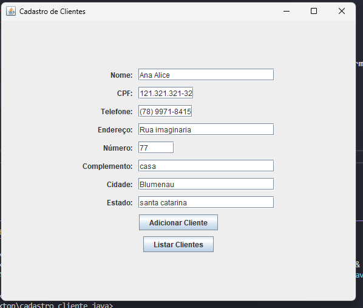
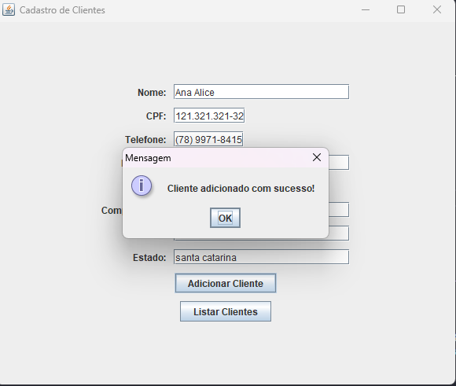
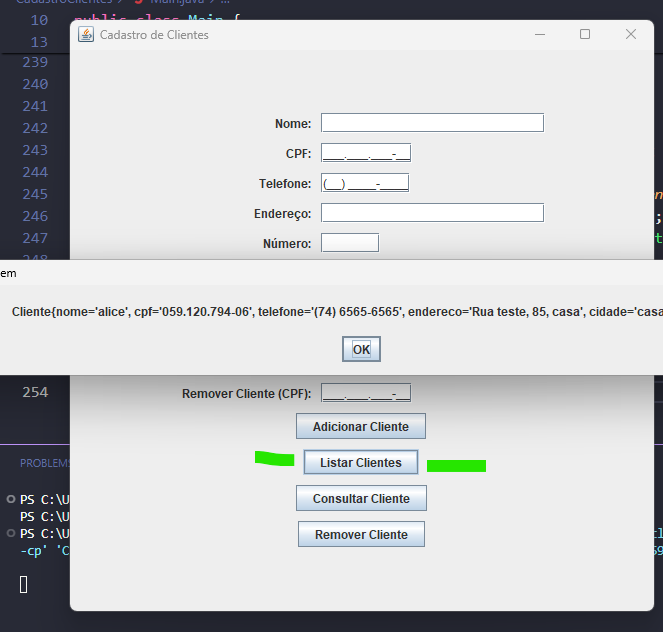
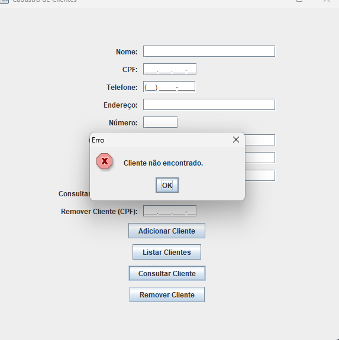
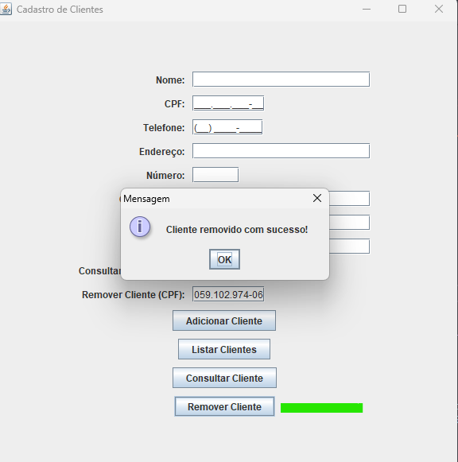

<!DOCTYPE html>
<html lang="pt-br">
<head>
    <meta charset="UTF-8">
    <meta name="viewport" content="width=device-width, initial-scale=1.0">
    <meta name="description" content="Cadastro de Clientes">
    <meta name="keywords" content="Java, Swing, Cadastro, Clientes, GUI">
    <meta name="author" content="Ana Alice Rodrigues">
</head>
<body>

<header>
    <h1>Cadastro de Clientes</h1>
    
    
    
    
    
</header>

    
Índice

    <ol>
        <li><a href="#sobre-o-projeto">Sobre o projeto</a></li>
        <li><a href="#parte-tecnica">Parte Técnica</a></li>
        <li><a href="#estrutura-dos-arquivos">Estrutura dos Arquivos</a></li>
        <li><a href="#casos-de-uso">Casos de Uso</a></li>
        <li><a href="#ferramentas">Ferramentas</a></li>
        <li><a href="#contato">Contato</a></li>
    </ol>

<section id="sobre-o-projeto">
    <h2>Sobre o projeto</h2>
    

        O projeto "Cadastro de Clientes" é uma aplicação desenvolvida em Java que permite gerenciar informações de clientes através de uma interface gráfica amigável. A aplicação possibilita adicionar, listar, consultar e remover clientes de forma eficiente.
    

    

        Proposta de Valor: Este programa é ideal para pequenas empresas ou empreendedores que precisam gerenciar dados de clientes de maneira organizada e acessível.
    

</section>

<section id="parte-tecnica">
    <h2>Parte Técnica</h2>
    <ul>
        <li><strong>Java:</strong> Linguagem de programação utilizada para desenvolver o programa.</li>
        <li><strong>Swing:</strong> Biblioteca gráfica do Java usada para criar a interface gráfica da aplicação.</li>
        <li><strong>GridBagLayout:</strong> Gerenciador de layout utilizado para organizar os componentes na interface de forma flexível e responsiva.</li>
        <li><strong>ArrayList:</strong> Estrutura de dados usada para armazenar a lista de clientes na memória.</li>
        <li><strong>Máscaras de Formatação:</strong> Utilização de máscaras para formatação dos campos de CPF e telefone, garantindo que os dados sejam inseridos no formato correto.</li>
    </ul>
</section>

<section id="estrutura-dos-arquivos">
    <h2>Estrutura dos Arquivos</h2>
    <ul>
        <li><code>Cliente.java</code>: Define a classe Cliente com propriedades como nome, CPF, telefone, endereço, número, complemento, cidade e estado.</li>
        <li><code>ClienteDAO.java</code>: Define a interface com operações para adicionar, obter, listar, atualizar e remover clientes.</li>
        <li><code>ClienteDAOImpl.java</code>: Implementa a interface ClienteDAO utilizando uma lista (ArrayList) para armazenar os dados dos clientes na memória.</li>
        <li><code>Main.java</code>: Contém o método principal que cria a interface gráfica e permite a interação do usuário com o programa.</li>
    </ul>
</section>

<section id="casos-de-uso">
    <h2>Casos de Uso</h2>
    <ul>
        <li>Gerenciamento de dados de clientes para pequenas empresas.</li>
        <li>Organização e categorização de clientes para fácil consulta e manutenção.</li>
    </ul>
</section>

<section id="ferramentas">
    <h2>Ferramentas</h2>
    <ul>
        <li></li>
        <li></li>
        <li></li>
    </ul>
</section>

<section id="contato">
    <h2>Contato</h2>
    <ul>
        <li></li>
    </ul>
</section>

</body>
</html>

